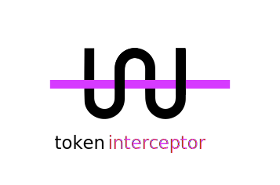

<p align="center">
  
</p>

<p align="center">
  <a href="https://expressjs.com/">Express</a> Middleware to Intercept token and make stuff, like refresh it.
</p>

## Install

```
yarn add token-interceptor
```

## Usage

```js
const express = require('express')
const intercept = require('svgson-next').default
const app = express()

app.use('/refresh', intercept({ url: 'https://api.service.io' }))
```

## API

intercept([options])

#### options

Type: `Object`

##### url

Endpoint where to forward token

Type: `String`

##### errorHandler

If passed has `err` as argument, otherwise `next(err)`

```js
{
  errorHandler: err => console.log(err)
}
```

Type: `Function`

##### getToken

Get input token from `req`

Type: `Function`

Required: true

```js
{
  getToken: req => req.body.token,
}
```
